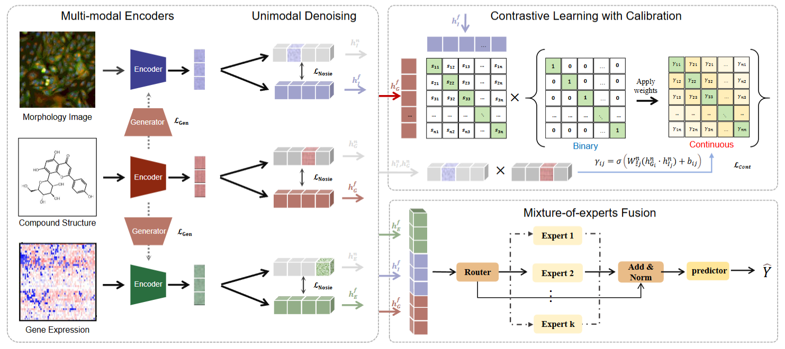

# MINER
## Multi-modal Contrastive Learning with Negative Sampling Calibration for Phenotypic Drug Discovery

The repository contains the code for the MINER presented in the paper Multi-modal Contrastive Learning with Negative Sampling Calibration for Phenotypic Drug Discovery.

## Set up the environment
```
conda create -n MINER python=3.10.13
conda activate MINER
bash env.sh
```

## Molecular Property Predictions
### ChEMBL2K
```
python main.py --dataset chembl2k
```

### Broad6K 
```
python main.py --dataset broad6k
```